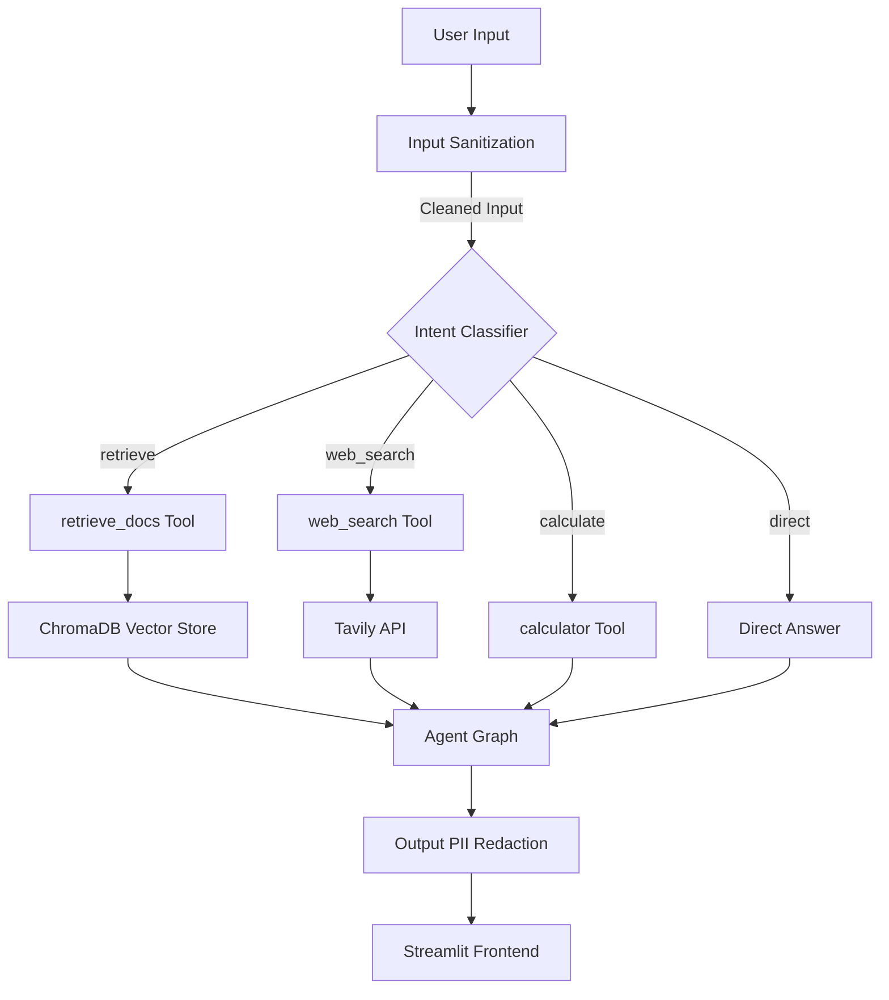

# AI Document Assistant

A portfolio-quality, RAG-based document chat application powered by a LangGraph agentic router, equipped with safety layers and evaluation metrics.

## What It Does
The AI Document Assistant allows users to upload PDF documents and ask questions about them. The system uses an agentic router to intelligently classify user intents and route queries to the appropriate tools. It can:
- **Retrieve information** directly from the uploaded PDFs with precise page-level citations.
- **Search the web** using the Tavily API for current events not covered in the documents.
- **Perform calculations** safely via a built-in math tool using Python's AST parser.
- **Answer directly** for conversational queries.

It is wrapped in a strict safety layer that neutralizes prompt injection attempts and redacts Personally Identifiable Information (PII) from model outputs.

## Architecture



## Tech Stack
- **Language:** Python 3.11+
- **LLM & Embeddings:** Google Gemini (`gemini-2.5-flash`, `gemini-embedding-2`) via `langchain-google-genai`
- **Orchestration:** LangChain + LangGraph
- **Vector Store:** ChromaDB (Persisted)
- **Web Search:** Tavily API
- **Frontend:** Streamlit
- **Evaluation:** RAGAS (Manual fallback supported)
- **Testing & Linting:** pytest, ruff

## Setup & Run Instructions

1. **Clone the repository:**
   ```bash
   git clone <repo-url>
   cd ai-document-assistant
   ```

2. **Create a virtual environment and install dependencies:**
   ```bash
   python -m venv venv
   source venv/bin/activate
   pip install -r requirements.txt
   ```

3. **Configure Environment Variables:**
   Copy the example file and add your API keys:
   ```bash
   cp .env.example .env
   ```
   *Required:* `GOOGLE_API_KEY` (Get one at [Google AI Studio](https://aistudio.google.com/))
   *Optional:* `TAVILY_API_KEY` (Required for web search functionality)

4. **Run the application:**
   ```bash
   streamlit run app.py
   ```

## Evaluation Results

Evaluation was performed using `src.eval` against a set of 10 sample Q&A pairs. 
*Note: The evaluation fell back to the manual scoring method because RAGAS failed due to missing OpenAI credentials.*

| Metric | Score | Description |
|--------|-------|-------------|
| **Faithfulness** | 1.0000 | Answer grounded in retrieved context |
| **Answer Relevancy** | 0.0479 | Answer addresses the question asked |
| **Context Precision** | 0.0000 | Most relevant chunks ranked highest |

*(Note: The low relevancy and precision scores in the current run are due to a ChromaDB `_type` query error resulting in "I don't have enough information" for most queries).*

## Deployment

**Deployed URL:** [Placeholder for Streamlit Community Cloud URL]

To deploy to Streamlit Community Cloud:
1. Push this repository to GitHub.
2. Log in to [Streamlit Community Cloud](https://share.streamlit.io/).
3. Click "New app", select your repository, branch, and set the main file path to `app.py`.
4. In "Advanced settings", add your `.env` variables (`GOOGLE_API_KEY`, etc.).
5. Click "Deploy".
